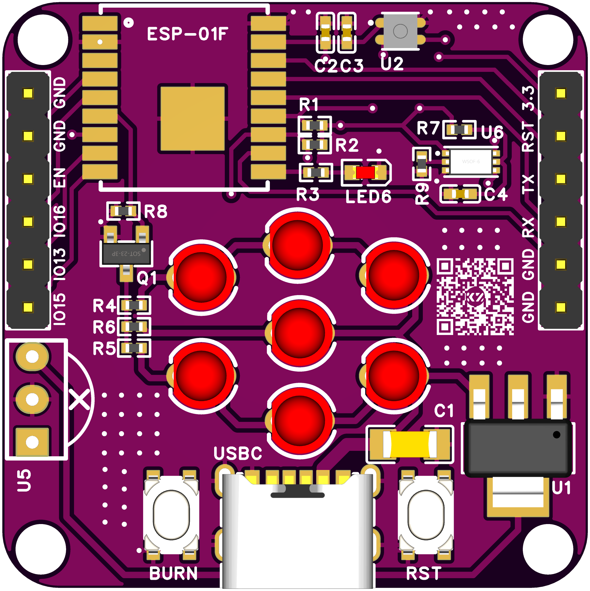
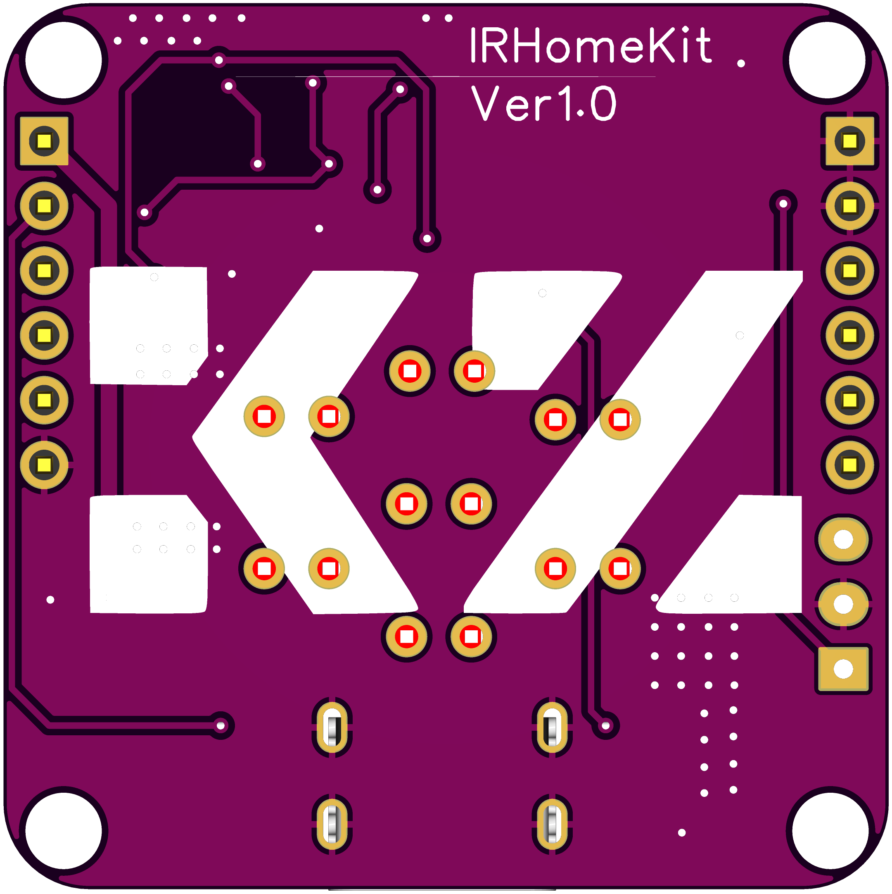

# IRHomekit
```
  _____  __                              _    _ _   
  \_   \/__\   /\  /\___  _ __ ___   ___| | _(_) |_ 
   / /\/ \//  / /_/ / _ \| '_ ` _ \ / _ \ |/ / | __|
/\/ /_/ _  \ / __  / (_) | | | | | |  __/   <| | |_ 
\____/\/ \_/ \/ /_/ \___/|_| |_| |_|\___|_|\_\_|\__|
                                                    
```
本项目由立创EDA设计完成。

### 原理图：


### PCB图


### 3D渲染图






### 参考项目：[ESP8266-IR-HOMEKIT](https://github.com/Mixiaoxiao/ESP8266-IR-HOMEKIT)


